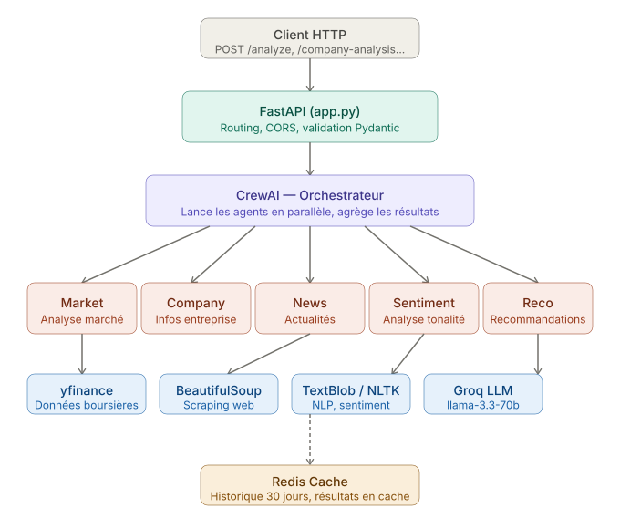

# Investra - Multi-Agent Stock Analysis

Fast multi-agent stock analysis using CrewAI, Groq LLM, Redis cache, and FastAPI.

## Features

- 5 parallel agents (market, company, news, sentiment, recommendations)
- Groq `llama-3.3-70b-versatile` LLM (free tier)
- Redis caching with 30-day conversation history
- REST API + CLI + Python module

## Architecture

The backend follows a simple request flow:

1. Client sends a request to FastAPI through endpoints such as `/analyze`, `/company-analysis`, or `/chat`.
2. `app.py` handles routing, validation, and CORS, then delegates work to the Investra orchestration layer.
3. CrewAI runs the analysis agents in parallel and aggregates their output.
4. The agents rely on these data sources and services:
   - `yfinance` for market data
   - `BeautifulSoup` for web scraping
   - `TextBlob` / `NLTK` for NLP and sentiment analysis
   - Groq LLM for reasoning and synthesis
5. Redis stores cached results and 30-day conversation history to reduce repeated work.



## Setup

```bash
# Install
git clone <repo>
cd my_project
python -m venv .venv
source .venv/Scripts/activate  # Windows: .venv\Scripts\activate
pip install -e .

# Configure .env
echo "GROQ_API_KEY=your_key" > .env
echo "REDIS_HOST=host.docker.internal" >> .env

# Start Redis
docker run -d -p 6379:6379 redis:latest
```

## Usage

**CLI:**

```bash
python -m my_project AAPL MSFT GOOGL
```

**Python:**

```python
from my_project.crew import run_crew
report = run_crew(['AAPL', 'MSFT'])
```

**API:**

```bash
uvicorn app:app --reload
# http://localhost:8000
```

## API Endpoints

| Method | Endpoint            | Purpose          |
| ------ | ------------------- | ---------------- |
| POST   | `/analyze`          | Market analysis  |
| GET    | `/company/{symbol}` | Company info     |
| POST   | `/company-analysis` | Company analysis |
| POST   | `/news-sentiment`   | News & sentiment |
| POST   | `/history`          | Get history      |
| DELETE | `/history`          | Clear history    |
| GET    | `/health`           | Health check     |

## Requirements

- Python 3.10+
- Redis
- Groq API key

## License

MIT
